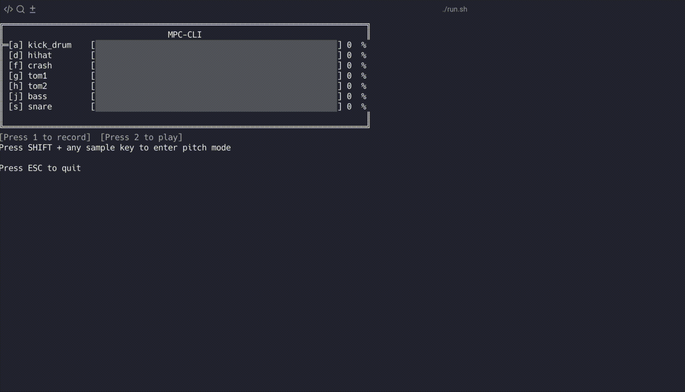

# MPC-CLI - MIDI Sampler & Sequencer

A real-time audio sampler and sequencer with pitch-shifting capabilities. Play samples, record sequences, and perform with pitched melodies - all from your keyboard. Built with C++20, GStreamer, and macOS CoreGraphics.



## Features

### **Real-time Sample Playback**
- Trigger audio samples instantly with keyboard keys
- Low-latency audio pipeline for responsive performance
- Volume control per sample

### **Sequencer**
- Record and loop sequences with sub-millisecond precision
- Stores timing and pitch information for each note
- Automatic looping with seamless wrap-around

### **Pitch Mode**
- Play any sample at different pitches using piano keyboard layout
- Ableton-style key mapping (AWSEDFTGYHUJ = chromatic scale)
- Octave shifting with Z/X keys
- Record pitched melodies into sequences
- Pitch-shifting via playback rate (changes pitch + tempo together)

### **Live Visualization**
- Real-time amplitude meters for each sample
- Sequencer status display (recording/playing)
- Pitch mode indicator with current octave
- Clean terminal UI using ANSI escape codes

## Architecture Overview

### Components

- **`input/`** - Keyboard input using low-level macOS CoreGraphics events
  - `keyboard_input.h/mm` - System-wide keyboard capture with SHIFT detection

- **`gstreamer/`** - GStreamer pipeline management
  - `gst_pipeline.h/cpp` - Audio pipeline with pitch-shifting support

- **`audio-processor/`** - Audio processing and pipeline management
  - `audio_processor.h/cpp` - Manages concurrent audio pipelines with pitch control

- **`sequencer/`** - MIDI-style sequencer
  - `sequencer.h/cpp` - Records and plays back timed note sequences with pitch

- **`visualizer/`** - Terminal-based visualization
  - `wave_visualizer.h/cpp` - Live amplitude display and status UI

- **`main.cpp`** - Program entry point and event loop coordination

## Requirements

- **macOS** (uses CoreGraphics and Carbon frameworks)
- **CMake** 3.15.3 or higher
- **GStreamer** 1.4 or higher
- **C++20** compiler (Clang/GCC)

## Installation

### 1. Install GStreamer

```bash
brew install gstreamer
```

### 2. Build the Project

```bash
cd cpp-test
./run.sh
```

This will build and run the application.

## Configuration

### samples.yaml

Audio samples are configured in `samples.yaml`. Each sample has:

```yaml
samples:
  kick:
    path: samples/kick.wav
    key: q              # Keyboard key to trigger
    volume: 0.8         # Volume (0.0 to 1.0)

  snare:
    path: samples/snare.wav
    key: s
    volume: 0.8

  hihat:
    path: samples/hihat.wav
    key: d
    volume: 0.6
```

**Supported audio formats**: WAV, MP3, OGG, FLAC, and any format supported by GStreamer.

## Troubleshooting

### "Failed to create event tap"
→ Grant Accessibility permissions

### "Audio file does not exist"
→ Add audio files to `samples/` directory

### "Failed to create pipeline"
→ Ensure GStreamer is installed: `brew install gstreamer`

### No sound when playing samples
→ Check volume levels in `samples.yaml`
→ Verify audio files are valid: `gst-play-1.0 samples/kick.wav`

### Build errors about GStreamer
```bash
brew install gstreamer
```

## Inspiration

This project is inspired by:
- **Akai MPC** series samplers
- **Ableton Live** keyboard mapping
- Hardware MIDI controllers and drum machines
